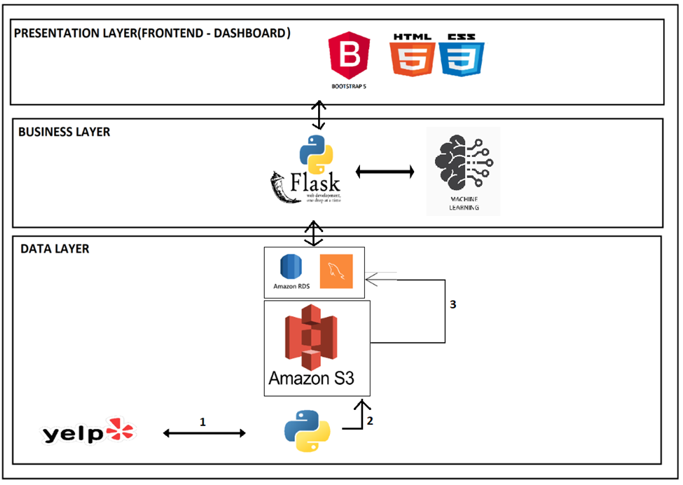

A customizable customer-oriented dashboard for hotel reviews sentiment analysis and services comparisons.
## Hotel Reviews Sentiment Analysis and Services Comparison
The goal of this project is to create a sentiment predictor and a services comparison tool for hotel reviews, tailored to the needs of hotel guests. The tool will provide insights into which services are most highly rated by guests, allowing customers to make informed choices when choosing a hotel.

## Prooject Architecture




**Data Layer**: The segment of the project where the data collection, data cleaning and profiling of the data is being done.
1)	In Data Layer, we are getting the hotel data using Yelp API using Python programming language 
2)	In the next step, we are doing the data cleaning and filtering the required columns and store the data in Amazon S3 bucket.
3)	In the third step , we are extracting the data from raw data and loading the data into Amazon RDS MqSQL database
**Business Layer**:
We will fetch the data for performing the Machine model processing and data required for Dashboard in business layer using Power BI and Flask Server

**Presentation Layer**:
For developing web pages we are using Bootstrap , HTML and CSS.

## Installation

+To get started, install the project and its dependencies using the following command:
Provide instructions on how to install the project and its dependencies.
```
pip install -r requirements.tx
```

## Usage

Explain how to use the project, including examples.
> ## Steps involved in Data retrival
1) The data retrival process starts by running the following file : 
    process.py in api_operations folder# Project Title

2) The process.py file initiates the data collection from the Yelp API based on the parameters specified in the params.json file located in the static folder.

3) Once the data is retrieved, it is processed and cleaned using various utility functions.

4) The cleaned data is then saved to an S3 bucket using the saveToS3 function from the s3_functions/utils.py file.

5) After the data is stored in S3, it is loaded into an RDS database for further processing and analysis.

## Data Preprocessing and Model Training

6) The data is then retrieved from the RDS database using the get_data method in the Sentiment_Analysis class (Mod_Sentiment_Analysis.py).

7) The retrieved data undergoes preprocessing steps such as text cleaning, tokenization, stop word removal, and lemmatization.

8) Features are then extracted from the preprocessed text using techniques like Bag of Words (BoW) or TF-IDF.

9) The preprocessed and feature-engineered data is split into training and testing sets.

10) Various machine learning models (e.g., Naive Bayes, Logistic Regression, SVM, Random Forest) are trained on the data.

11) The models are evaluated using metrics such as accuracy, precision, recall, and F1-score.

## Dashboard Creation and Deployment

12) The best performing model is selected and used to create predictions on new, unseen data.

13) A dashboard is created using a framework like Dash or Streamlit to visualize the sentiment analysis results and service comparisons.

14) The dashboard is deployed to a cloud platform (e.g., AWS, Heroku) for public access.

## Continuous Integration and Deployment

15) A CI/CD pipeline is set up to automatically test, build, and deploy updates to the project.

16) Regular updates are made to the model and dashboard based on new data and user feedback.

For more detailed information on each step, please refer to the respective files and folders in the project structure.
